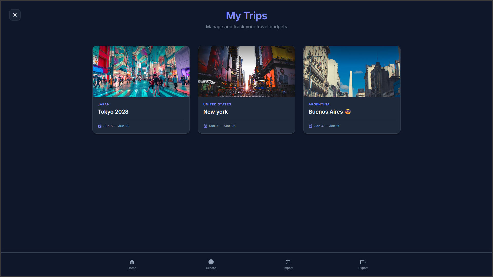

# ✈️ MyTrips

A professional full-stack web application for managing travel itineraries and budgets. Plan your journeys, track daily expenses, and stay on budget with a clean, high-performance interface.

## ⭐ Features

- **Trip Management** – Create, edit, and delete trips with destinations, dates, and budget tracking.
- **Daily Itinerary** – Plan activities by specific dates with a dedicated calendar view.
- **Expense Tracking** – Log spending by category with real-time visual breakdowns.
- **Budget Dashboard** – Monitor remaining budget vs. estimated costs at a glance.
- **Import/Export Data** – Export your trips to a JSON file that can later be imported.
- **Privacy-First Storage** – Data is handled via portable JSON storage, no personal data persists.

## 🛠️ Tech Stack

| Layer | Technology |
|-------|------------|
| **Frontend** | React + TypeScript + Vite |
| **Styling** | Vanilla CSS (Global Variables & Design System) |
| **Backend** | .NET 10 + C# |
| **Dev Ops** | npm concurrency (Single-command execution) |
| **Data** | JSON File-Based Storage |

## 📱 Usage

* **Creating a Trip:** Click "Plan Your First Trip" and fill in the details. Add an image URL to personalize your dashboard.
* **Managing Expenses:** Inside a trip, use "+ Add Expense". Categorize spending to see your budget update in real-time.
* **Data Portability:** Use the **Import/Export** feature in the Trip List to back up your trips or move them between devices via JSON files.

## 🔒 License & Copyright

**Copyright (c) 2026 geronimo fayo**

All rights reserved. This software and its source code are for **demonstration and personal use only**.

* ❌ **Commercial use is strictly prohibited.**
* ❌ **Redistribution of modified or unmodified versions is not allowed.**
* ❌ **You may not host this application as a service for others.**

*If you are a recruiter or developer interested in the architecture of this project, feel free to explore the code. For any other use, please contact the author.*

---

*Built with ❤️ for travelers who love organization.*
